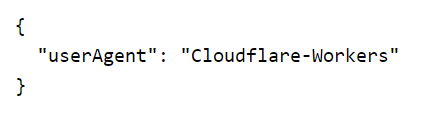

# remix-vite-miniflare

Sample of Remix running on Miniflare.

## vitePlugin/miniflare.ts

```ts
import { build } from "esbuild";
import { ViteDevServer } from "vite";
import { Miniflare } from "miniflare";
import path from "path";

async function getTransformedCode(modulePath: string) {
  const result = await build({
    entryPoints: [modulePath],
    bundle: true,
    format: "esm",
    minify: true,
    write: false,
  });
  return result.outputFiles[0].text;
}

export const createMiniflare = async (viteDevServer: ViteDevServer) => {
  const modulePath = path.resolve(__dirname, "miniflare_module.ts");
  const code = await getTransformedCode(modulePath);

  const miniflare = new Miniflare({
    compatibilityDate: "2024-08-21",
    modulesRoot: "/",
    modules: [
      {
        path: modulePath,
        type: "ESModule",
        contents: code,
      },
    ],
    unsafeEvalBinding: "__viteUnsafeEval",
    serviceBindings: {
      __viteFetchModule: async (request) => {
        const args = (await request.json()) as Parameters<
          typeof viteDevServer.environments.ssr.fetchModule
        >;
        const result = await viteDevServer.environments.ssr.fetchModule(
          ...args
        );
        return new Response(JSON.stringify(result));
      },
    },
  });
  return miniflare;
};
```

## vitePlugin/miniflare_module.ts

```ts
import {
  FetchResult,
  ModuleRunner,
  ssrModuleExportsKey,
} from "vite/module-runner";

export type RunnerEnv = {
  __viteUnsafeEval: {
    eval: (
      code: string,
      filename?: string
    ) => (...args: unknown[]) => Promise<void>;
  };
  __viteFetchModule: {
    fetch: (request: Request) => Promise<Response>;
  };
};

class WorkerdModuleRunner extends ModuleRunner {
  constructor(env: RunnerEnv) {
    super(
      {
        root: "/",
        sourcemapInterceptor: "prepareStackTrace",
        transport: {
          fetchModule: async (...args) => {
            const response = await env.__viteFetchModule.fetch(
              new Request("https://localhost", {
                method: "POST",
                body: JSON.stringify(args),
              })
            );
            return response.json<FetchResult>();
          },
        },
        hmr: false,
      },
      {
        runInlinedModule: async (context, transformed, id) => {
          const keys = Object.keys(context);
          const fn = env.__viteUnsafeEval.eval(
            `'use strict';async(${keys.join(",")})=>{${transformed}}`,
            id
          );
          await fn(...keys.map((key) => context[key as keyof typeof context]));
          Object.freeze(context[ssrModuleExportsKey]);
        },
        async runExternalModule(filepath) {
          return import(filepath);
        },
      }
    );
  }
}

export default {
  async fetch(request: Request, env: RunnerEnv) {
    const runner = new WorkerdModuleRunner(env);
    const entry = request.headers.get("x-vite-entry")!;
    const mod = await runner.import(entry);
    const handler = mod.default as ExportedHandler;
    if (!handler.fetch) throw new Error(`Module does not have a fetch handler`);
    try {
      const result = handler.fetch(request, env, {
        waitUntil: () => {},
        passThroughOnException() {},
      });
      return result;
    } catch (e) {
      return new Response(String(e), { status: 500 });
    }
  },
};
```

## vitePlugin/index.ts

```ts
import { once } from "node:events";
import { Readable } from "node:stream";
import path from "path";
import { Connect, Plugin as VitePlugin } from "vite";
import type { ServerResponse } from "node:http";
import { createMiniflare } from "./miniflare";
import {
  Response as MiniflareResponse,
  Request as MiniflareRequest,
  RequestInit,
} from "miniflare";

export function devServer(): VitePlugin {
  const plugin: VitePlugin = {
    name: "edge-dev-server",
    configureServer: async (viteDevServer) => {
      const runner = createMiniflare(viteDevServer);
      return () => {
        if (!viteDevServer.config.server.middlewareMode) {
          viteDevServer.middlewares.use(async (req, nodeRes, next) => {
            try {
              const request = toRequest(req);
              request.headers.set(
                "x-vite-entry",
                path.resolve(__dirname, "server.ts")
              );
              const response = await (await runner).dispatchFetch(request);
              await toResponse(response, nodeRes);
            } catch (error) {
              next(error);
            }
          });
        }
      };
    },
    apply: "serve",
    config: () => {
      return {
        ssr: {
          noExternal: true,
          target: "webworker",
          optimizeDeps: {
            include: [
              "react",
              "react/jsx-dev-runtime",
              "react-dom",
              "react-dom/server",
              "@remix-run/server-runtime",
              "@remix-run/cloudflare",
            ],
          },
        },
      };
    },
  };
  return plugin;
}

export function toRequest(nodeReq: Connect.IncomingMessage): MiniflareRequest {
  const origin =
    nodeReq.headers.origin && "null" !== nodeReq.headers.origin
      ? nodeReq.headers.origin
      : `http://${nodeReq.headers.host}`;
  const url = new URL(nodeReq.originalUrl!, origin);

  const headers = Object.entries(nodeReq.headers).reduce(
    (headers, [key, value]) => {
      if (Array.isArray(value)) {
        value.forEach((v) => headers.append(key, v));
      } else if (typeof value === "string") {
        headers.append(key, value);
      }
      return headers;
    },
    new Headers()
  );

  const init: RequestInit = {
    method: nodeReq.method,
    headers,
  };

  if (nodeReq.method !== "GET" && nodeReq.method !== "HEAD") {
    init.body = nodeReq;
    (init as { duplex: "half" }).duplex = "half";
  }

  return new MiniflareRequest(url, init);
}

export async function toResponse(
  res: MiniflareResponse,
  nodeRes: ServerResponse
) {
  nodeRes.statusCode = res.status;
  nodeRes.statusMessage = res.statusText;
  nodeRes.writeHead(res.status, Object.entries(res.headers.entries()));
  if (res.body) {
    const readable = Readable.from(
      res.body as unknown as AsyncIterable<Uint8Array>
    );
    readable.pipe(nodeRes);
    await once(readable, "end");
  } else {
    nodeRes.end();
  }
}
```

## vitePlugin/server.ts

```ts
import { createRequestHandler } from "@remix-run/cloudflare";
// eslint-disable-next-line import/no-unresolved
import * as build from "virtual:remix/server-build";
import type { AppLoadContext } from "@remix-run/cloudflare";

const fetch = async (req: Request, context: AppLoadContext) => {
  const handler = createRequestHandler(build);
  return handler(req, context);
};

export default { fetch };
```

## vite.config.ts

```ts
import {
  vitePlugin as remix,
  // cloudflareDevProxyVitePlugin as remixCloudflareDevProxy,
} from "@remix-run/dev";
import { defineConfig } from "vite";
import tsconfigPaths from "vite-tsconfig-paths";
import { devServer } from "./vitePlugin";

export default defineConfig({
  plugins: [
    // remixCloudflareDevProxy(),
    devServer(),
    remix({
      future: {
        v3_fetcherPersist: true,
        v3_relativeSplatPath: true,
        v3_throwAbortReason: true,
      },
    }),
    tsconfigPaths(),
  ],
});
```

## app/routes/\_index.tsx

```tsx
import type { MetaFunction } from "@remix-run/cloudflare";
import { useLoaderData } from "@remix-run/react";

export const meta: MetaFunction = () => {
  return [
    { title: "New Remix App" },
    {
      name: "description",
      content: "Welcome to Remix on Cloudflare!",
    },
  ];
};

export default function Index() {
  const value = useLoaderData<Record<string, unknown>>();
  return (
    <div className="font-sans p-4">
      <pre>{JSON.stringify(value, null, 2)}</pre>
    </div>
  );
}

export function loader() {
  return {
    userAgent: navigator.userAgent,
  };
}
```


